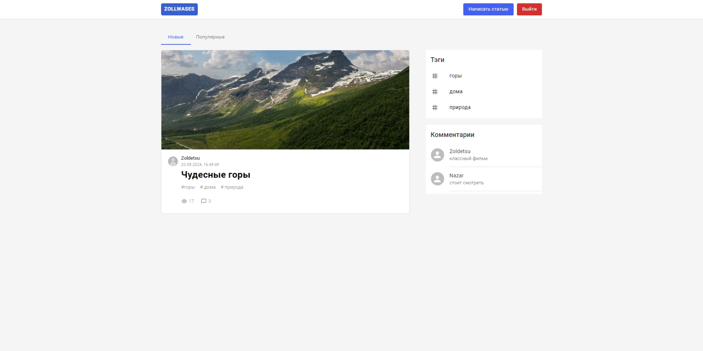
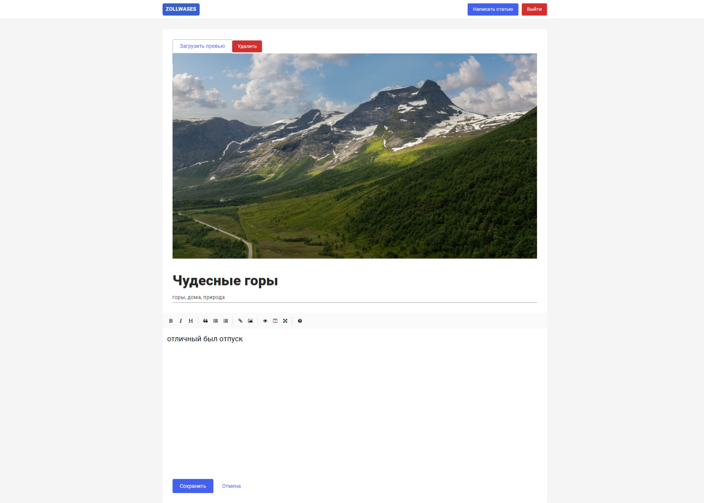
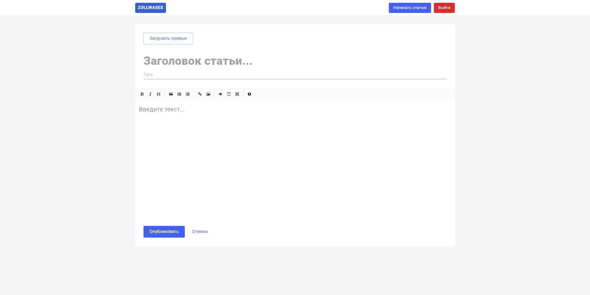

# Zollwases

Zollwases - индивидуальный проект, где пользователи могут создавать, редактировать, сортировать по тегам, дате и популярности, а также удалять свои посты. Веб-приложение поддерживает многопользовательскую систему с авторизацией.

## Технологии

- React
- Redux toolkit
- JavaScript
- Node js
- express
- postgreSQL
- Prisma |
- material UI
- TypeScript

## Скриншоты

### Главная страница

### Редактирование поста

### Создание поста

